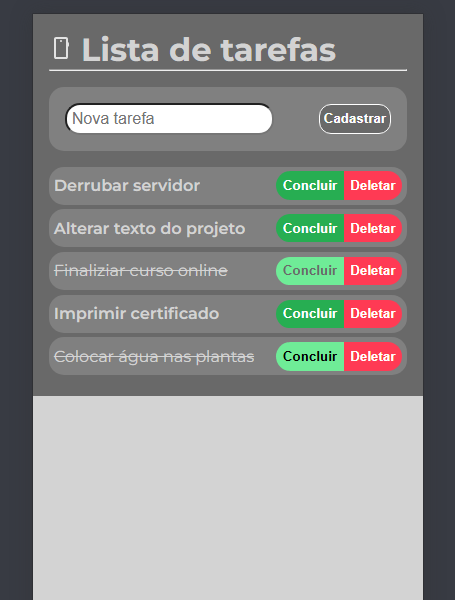
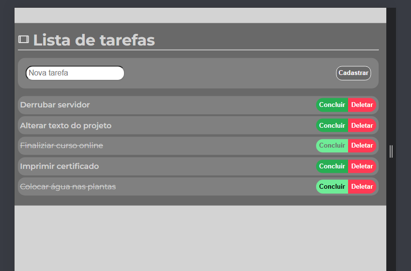
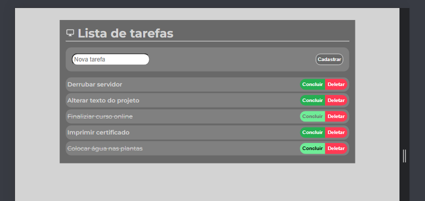

<h1>Projeto - Curso Alura: JavaScript na Web: manipule o DOM com JavaScript</h1>

## Objetivo

O Objetivo do curso é aplicar conhecimentos de Javascript na estrutura de uma página de listagem de terefas de maneira dinâmica.

No projeto inicial do curso foi disponibilizado um Front-End preparado em HTML e CSS, mas este repositório tem uma página construída do zero!

## Sobre o curso

[Link da página do curso](https://www.alura.com.br/curso-online-javascript-manipulando-elementos-dom)

[Link certificado de conclusão](https://cursos.alura.com.br/certificate/lucasduartedev/javascript-manipulacao-dom)

## Técnicas/Habilidades utilizadas

- Responsividade;
- Mobile first.

- Manipulação do DOM;
- Código modularizado;
- Exportar/Importar de Componentes.

## Imagens - Resultado Final

- Mobile - Ocupando a tela inteira por ter espaço reduzido

- Tablet

- Desktop - Limite do tamanho da listagem das tarefas

